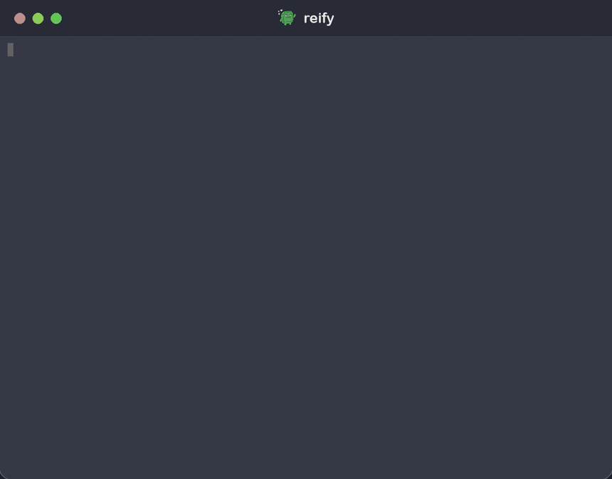
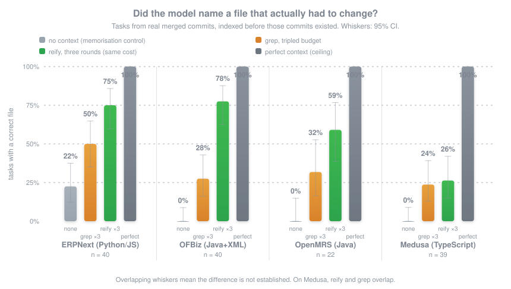
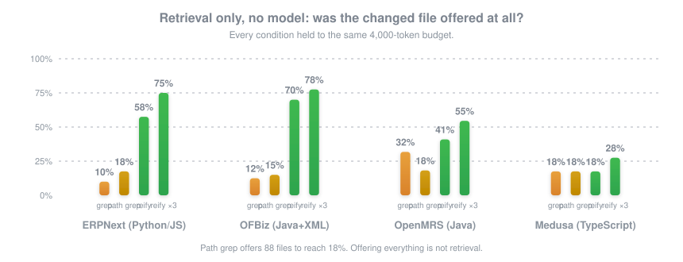

<p align="center">
  <picture>
    <source media="(prefers-color-scheme: dark)" srcset="assets/logo-dark.svg">
    
  </picture>
</p>

<p align="center">
  <em>The business logic lives in one person's head.<br>Reify gets it out, without asking them to write documentation.</em>
</p>

<p align="center">
  <sub>Already installed? Run <code>reify upgrade</code></sub>
</p>

<p align="center">
  <strong>deterministic knowledge graph &middot; every claim cited &middot; BA documents to code &middot; one binary, no daemon &middot; never opens a socket</strong>
</p>

<p align="center">
  <a href="LICENSE"></a>
  <a href="#what-it-reads"></a>
  <a href="#what-it-reads"></a>
  <a href="#privacy"></a>
  <a href="#development"></a>
  <a href="#architecture"></a>
</p>

<p align="center">
  <a href="#claude-code"></a>
  <a href="#codex-cursor-opencode-aider-pi-windsurf-cline"></a>
  <a href="#codex-cursor-opencode-aider-pi-windsurf-cline"></a>
  <a href="#codex-cursor-opencode-aider-pi-windsurf-cline"></a>
  <a href="#codex-cursor-opencode-aider-pi-windsurf-cline"></a>
  <a href="#mcp"></a>
  <a href="#install"></a>
</p>

<p align="center">
  <strong>On SWE-bench Verified, Reify puts the file that had to change in front of the model 84.6% of the time — grep manages 6.6% &middot; 500 real issues, someone else's benchmark &middot; never opens a socket</strong><br>
  <sub>A real model on 142 tasks from real merged commits across ERPNext, OFBiz, OpenMRS and Medusa, each index built at a commit <em>before</em> those changes existed. That is <em>retrieval</em>: the right file, in front of the model. On end-to-end patch correctness a BM25 baseline currently resolves <em>more</em> issues than Reify does, and <a href="#the-end-to-end-result-which-does-not-go-our-way">the section saying so</a> is as prominent as this one. <a href="benchmarks/REPORT.md">Full writeup</a> &middot; <a href="#reproducing-the-benchmark">reproduce it</a>.</sub>
</p>

<p align="center">
  
</p>

<p align="center">
  <sub>Every command in the demo is real, against a real ERPNext index. The recording script is <a href="assets/demo-script.sh">committed</a> (recorded with terminalizer); if the GIF ever disagrees with the tool, re-record the GIF.</sub>
</p>

## Two minutes to first answer

```bash
curl -fsSL https://raw.githubusercontent.com/lambiengcode/reify/main/install.sh | sh
cd your-repository
reify init --write-agent-instructions   # wires your agent through AGENTS.md / CLAUDE.md
reify index                             # 4.6 s for 5,000 files; 0.7 s after one edit
reify context "the change you are about to make" --toon
```

<sub>One static binary — no daemon, no config, no API key, and every release ships a
SHA-256 checksum that `reify upgrade` verifies before installing. Changed your mind?
`reify uninstall` removes the binary and `reify uninit` cleans one repository, both
showing their plan first. Per-agent wiring, hooks and MCP: <a href="#install">Install</a>.</sub>

<p align="center">
  <strong>English</strong> &middot; <a href="README.vi.md">Tiếng Việt</a> &middot; <a href="README.zh.md">简体中文</a>
</p>

---

<details>
<summary><strong>Contents</strong></summary>

- [Two minutes to first answer](#two-minutes-to-first-answer)
- [The one-person problem](#the-one-person-problem)
- [What it actually gives you](#what-it-actually-gives-you)
- [Before / after](#before--after)
- [SWE-bench Verified](#numbers-on-a-benchmark-we-did-not-design) — 84.6% vs grep's 6.6%
- [Numbers](#numbers-on-four-repositories-chosen-to-hurt) — [retrieval alone](#retrieval-on-its-own-no-model-involved) · [the scorecard](#the-scorecard-against-targets-set-before-the-work) · [where it doesn't work](#where-it-doesnt-work)
- [How it works](#how-it-works) — [four bridges to code](#four-bridges-from-business-vocabulary-to-code)
- [What it reads](#what-it-reads)
- [Multilingual](#multilingual)
- [Install](#install) — [Claude Code](#claude-code) · [other agents](#codex-cursor-opencode-aider-pi-windsurf-cline) · [MCP](#mcp) · [a model](#optional-a-model)
- [Commands](#commands)
- [Privacy](#privacy)
- [Architecture](#architecture) — [measured performance](#measured-performance)
- [Reproducing the benchmark](#reproducing-the-benchmark)
- [Development](#development)
- [FAQ](#faq)
- [Roadmap](#roadmap) · [Status](#status) · [License](#license)

</details>

## The one-person problem

Your system is eleven years old. The business logic is enormous and mostly
undocumented — there are BA documents in SharePoint from 2019, and some of them are
still true.

**One person understands it.** They can't take a holiday without a phone. You can't
hire around them, because a new developer needs the better part of a year before they
are useful, and the knowledge they would need to absorb isn't written down anywhere —
it's in that one person's head, and they are far too busy to write it down.

So you point an AI coding agent at it. The agent is brilliant on new code and useless
here. It reads the wrong forty files, misses the rule that mattered, and confidently
changes behaviour a customer depends on. Then the one person has to review it, which
was the bottleneck you were trying to remove.

**Reify gets that knowledge out of one head and into a form your agents and your new
hires can both use — without asking anyone to write documentation they will never
write.** It compiles what already exists: the code, the BA documents nobody reads, the
database schema, and eleven years of commit messages explaining why.

### Does this sound like your codebase?

- [x] Older than the newest person on the team
- [x] Business rules spread across code, stored procedures, config and someone's memory
- [x] No developer documentation. Some BA documents in Word or PDF, of uncertain age
- [x] "Ask Minh, he wrote that" is a normal answer to a technical question
- [x] Onboarding is measured in months
- [x] The documentation you *do* have disagrees with the code, and nobody knows where
- [x] AI agents work fine on your side projects and fall apart on this
- [x] Source code cannot leave the building

Reify was built for exactly this. If none of it sounds familiar, you probably don't
need it — see the [FAQ](#faq).

## What it actually gives you

Three questions, answered from evidence rather than from a model's recollection:

| Question | Command | Who asks it |
|---|---|---|
| *Why does this code exist?* | `reify why <file>:<line>` | the new hire, on day two |
| *What breaks if I change it?* | `reify impact "<symbol>"` | the person doing the change |
| *What must I know before I start?* | `reify context "<task>"` | **your AI agent, every time** |

The third is the one that matters. It hands an agent the smallest set of rules,
citations, code spans and known contradictions it needs — and nothing else.

### For the person everything depends on

You don't have to write the documentation. Reify reads what is already there and, where
it has guessed, `reify concepts --suggest` hands you a draft glossary to correct in an
afternoon instead of authoring one from nothing. Ten minutes of your corrections is
worth more to the system than a week of anyone else's archaeology.

### For the person who just joined

```bash
reify report                       # what am I even looking at
reify explain "credit limit"       # in every language it appears in
reify flow "order approval"        # the code path, in order
reify conflicts                    # where the docs are lying to me
```

## Before / after

You ask your agent to change the order approval threshold. It greps for `50000000`, finds one hit, changes it, and ships. It never learns that the BRD says corporate customers always need approval while the code has been quietly bypassing it since 2019.

With reify:

```
$ reify why erpnext/selling/doctype/sales_order/sales_order.py:812

  [CONFLICT] documentation and implementation disagree about approval
    documented   Corporate customers must require approval    docs/BRD-42.md:6
    observed     Corporate customers bypass approval          sales_order.py:812

  Called by     3 services, 1 batch job
  Writes        tabSales Order, approval_log
  History       8a31c2f  2019-04-17  fix: enterprise approval flow
```

Three of those four sections are things grep structurally cannot produce.

## Numbers, on a benchmark we did not design

The four-repository benchmark below is ours, which is exactly the reason to also run
somebody else's. **[SWE-bench Verified](https://openai.com/index/introducing-swe-bench-verified/)**
is 500 real GitHub issues from twelve well-known Python projects, each pinned to the
`base_commit` the issue was filed against — the same index-before-the-change protocol
Reify's own benchmark uses, written by other people. The task is a plain issue report;
the right answer is the set of files the accepted fix actually touched.

| retrieval on SWE-bench Verified, n=500 | offered a file the fix touched | MRR | offered **every** such file | median tokens |
|---|--:|--:|--:|--:|
| grep, content | 6.6% <sub>[4.7–9.1]</sub> | 0.06 | 5.6% | 3,998 |
| grep, paths | 9.0% <sub>[6.8–11.8]</sub> | 0.06 | 7.8% | 3,996 |
| **reify**, one round | **66.0%** <sub>[61.7–70.0]</sub> | 0.43 | 59.0% | **3,466** |
| **reify**, three rounds | **84.6%** <sub>[81.2–87.5]</sub> | 0.45 | 77.0% | 9,174 |

**A single round of Reify beats grep on 310 instances and loses on 13 — while spending
fewer tokens** (3,466 against 3,998). Three rounds win 395 to 5 (exact McNemar
p ≈ 7 × 10⁻¹¹⁰). This is not a close measurement, and it is the cleanest number in this
README precisely because the tasks, the repositories and the ground truth all came from
somewhere else.

Per repository, three rounds against content-grep:

| | grep | reify ×3 | | | grep | reify ×3 |
|---|--:|--:|---|---|--:|--:|
| django (n=231) | 6% | **88%** | | astropy (n=22) | 0% | **77%** |
| sympy (n=75) | 7% | **77%** | | xarray (n=22) | 9% | **91%** |
| sphinx (n=44) | 7% | **75%** | | pytest (n=19) | 26% | **84%** |
| matplotlib (n=34) | 0% | **91%** | | pylint (n=10) | 10% | **60%** |
| scikit-learn (n=32) | 9% | **88%** | | requests (n=8) | 0% | **100%** |

**What this does and does not show.** It measures retrieval — whether the files that
had to change are put in front of the model — not whether the model then writes a
correct patch. Verified is Python-only, so it says nothing about the modern-TypeScript
weakness [below](#where-it-doesnt-work). And these repositories are famous enough that
models have partly memorised them; that affects a model's *answers*, not which files a
retriever offers, and every arm here ran against the same index at the same commit.
Reproduce it with the driver in [`benchmarks/swe/`](benchmarks/swe/).


### The end-to-end result, which does not go our way

Retrieval is not this project's final claim — resolving the issue is. So the same
benchmark was run through the SWE-bench paper's own retrieval-augmented protocol: one
model, one context budget, the retriever as the only difference between arms, and every
patch judged by the **official SWE-bench harness** in Docker. 101 stratified instances;
72 of them graded under both arms.

| resolved the issue | | 95% CI |
|---|--:|---|
| BM25 | **18.1%** (13/72) | [10.9–28.5] |
| Reify | 11.1% (8/72) | [5.7–20.4] |

BM25 solved 8 instances Reify did not; Reify solved 3 BM25 did not (exact McNemar
p = 0.23). At this sample size that is not a significant difference — but the point
estimate favours BM25, and it is reported in that direction because that is the
direction it came out in.

**The diagnostic is worth more than the number.** In 5 of the 8 instances BM25 resolved
and Reify did not, **Reify had already offered a file the fix touched.** So these are not
retrieval failures. Putting the right file in front of a model and giving that model what
it needs to write the patch are different problems, and Reify is measurably much better
at the first than at the second.

One limitation, stated as a limitation and not as a defence: this protocol used Reify as
a *file ranker*, feeding whole files, which throws away what `reify context` actually
produces — spans, rules, citations, conflicts, the budgeted reading plan. Feeding the
compiled context instead is the obvious next experiment. It has not been run, so it
proves nothing yet.

<details>
<summary><strong>Getting SWE-bench to run at all on Apple Silicon</strong></summary>

Two things had to be fixed before either arm could be measured honestly, and both are in
[`benchmarks/swe/`](benchmarks/swe/):

- **40 instances had no runnable environment.** Their conda specs pin packages such as
  `setuptools==38.2.4` that were never built for `aarch64`, which is why SWE-bench
  publishes no arm64 image for them and why building locally fails too. The fix is to
  force the harness's own `USE_X86` escape hatch on for every instance and pre-pull each
  image with `--platform linux/amd64`, since the harness otherwise pulls with the
  daemon's native platform and 404s. After that: zero environment errors.
- **Roughly 45% of patches would not apply,** because a model asked for exact SEARCH text
  reproduces these famous repositories from memory rather than from the listing. Numbering
  every line of the context and asking for line-range replacements dropped that to ~1%.

Images are pulled, graded and deleted in batches, so peak disk stays near 18 GB instead
of the ~200 GB a naive pre-pull needs.

</details>

## Numbers, on four repositories chosen to hurt

The honest measurement is a real model doing a real task: tickets taken from merged
commits, where the prompt is the developer's own description of the change and the
right answer is the files they actually touched. **Every index is built at a commit
before any of those changes existed**, so the code being asked for is genuinely absent.
Four repositories, chosen partly to hurt; several conditions exist to break the result
rather than support it.

<p align="center">
  
</p>

The headline comparison is cost-matched: Reify iterates three rounds (an agent that
reads, doesn't find it, and asks again — with the already-read files excluded), so the
control is grep handed the same tripled budget outright.

| model-in-the-loop, hit rate | grep ×3 budget | **reify ×3 rounds** | margin | 95% CIs overlap? |
|---|--:|--:|--:|---|
| ERPNext (Python/JS), n=40 | 50% | **75%** | +25 | barely |
| OFBiz (Java + XML), n=40 | 28% | **78%** | +50 | no |
| OpenMRS (Java), n=22 | 32% | **59%** | +27 | barely |
| Medusa (modern TS), n=40 | 24% | **26%** | +2 | **fully — no win** |

> **A note on the fourth row:** Medusa's +2 is a tie, not a win, and it stays in the
> headline table at full prominence rather than in a footnote. What separates the
> repositories where Reify wins big from the one where it doesn't is measured, not
> guessed — see [Where it doesn't work](#where-it-doesnt-work).

**The controls, on every repository:** perfect context scores 100% everywhere, so
retrieval quality is the entire game. A decoy context of identical shape scores 0–12%,
so the content is doing the work, not the format. With no repository access the model
scores 0% on three repositories and **22% on ERPNext** — it has partially memorised the
most famous repo, which is exactly why the other three exist and why every headroom
figure subtracts that floor. Seven of ~1,000 provider calls failed, all on Medusa runs;
failed calls are excluded from rates, never scored as misses.

Single-shot, for the record: reify 55/68/41/15 against grep 30/12/41/21 at equal
single budget — on OFBiz a *single* reify round already beats grep by 56 points.

### Retrieval on its own, no model involved

<p align="center">
  
</p>

| a changed file was offered | grep | reify (MRR) | **reify ×3** |
|---|--:|--:|--:|
| ERPNext | 10% | 57% (0.45) | **75%** |
| OFBiz | 12% | 70% (0.45) | **78%** |
| OpenMRS | 32% | 41% (0.27) | **55%** |
| Medusa | 18% | 18% (0.09) | **28%** |

### The scorecard, against targets set before the work

Seven targets were pre-registered before the improvement work began. **One of seven
was met** (four repositories measured). Hit rate, headroom share, cross-repo gap, MRR,
precision and end-to-end completion all fell short of their bars. The gains are real —
the targets were set high on purpose, and unmet targets with honest numbers beat met
targets with soft ones.

### Where it doesn't work

**Medusa** — a modern, well-factored TypeScript monorepo — is the open problem, and it
inverts the project's founding assumption. The legacy Java systems were supposed to be
the hard case; they are the *best* cases. Medusa's tasks describe UI behaviour
("remove the duplicate cloud auth button") whose vocabulary barely intersects the
code, its history is squashed PR merges, and nothing Reify currently reads closes that
gap. Iteration lifts it 18→28% on retrieval; with the model, 26% against grep's 24%; the
intervals overlap completely.

The earlier hypothesis — "Reify's advantage scales with declared vocabulary" — did not
survive the four-repo test either. OFBiz declares little the way ERPNext does, yet
shows the largest margin of all. What the four repositories actually separate on is
whether *commit history and file naming speak the vocabulary the tasks are written
in*. Where they do, Reify recovers 54–62% of the oracle gap. Where they don't
(Medusa), it is grep with better structure.

<details>
<summary><strong>Older numbers, superseded measurements, and one fitting failure</strong></summary>

Three things a reader auditing this benchmark should know:

1. **An early run indexed at `HEAD`**, so the code being asked for was already present.
   That leaked toward the *lexical* baseline (new code contains the ticket's words).
   Fixed by indexing before each task window; all published numbers use that protocol.
2. **A weight-fitting experiment failed validation, as its pre-registration allowed
   for.** Grid search on training tasks (commits earlier than every benchmark task)
   preferred a history-prior weight of 2.2–5.5; every value in that range scored worse
   than the pre-fit default on the frozen tasks. The default reverted, the full
   training surface is committed in `benchmarks/weights/`, and the code comment on the
   constant tells the story.
3. **The frozen tasks were evaluated more than once** while diagnosing that failure
   and the Medusa result, so the margins should be read slightly softer than a
   one-look protocol would justify. Decisions were made on training data or from
   structural diagnosis — never by picking whatever maximised the frozen score — and
   the roadmap states this multiplicity in its own words.

</details>

## How it works

**Deterministic first. Semantic second. LLM last.** In this build there is no LLM at all unless you configure one, and every command still works without it.

```
1. Is it in the AST?          → symbols, calls, imports, inheritance
2. Is it in the data layer?   → tables, columns, ORM mappings, embedded SQL
3. Is it in a document?       → sections, cited by heading
4. Is it in git?              → who introduced it, what fixed it, what moves with it
5. Is it declared anywhere?   → glossary, entity metadata, translation files
6. Only then: infer it        → and mark it INFERRED, with the evidence attached
```

Every claim carries where it came from and how far to trust it:

| | |
|---|---|
| `CONFIRMED` | read straight out of a source file |
| `OBSERVED` | derived deterministically from confirmed facts |
| `INFERRED` | a heuristic. **Check the citation before acting on it** |
| `CONFLICTED` | two sources disagree. Resolve it before changing behaviour |
| `UNKNOWN` | explicitly unresolved, so absence is never read as evidence |

`Status::Unknown` is the `Default` on purpose. Anything that forgets to state its footing lands on the one an agent may not act on.

### Four bridges from business vocabulary to code

In precision order. The last is what makes Reify work on a repository that declares nothing at all.

| Bridge | Source | Available when |
|---|---|---|
| **Declared** | `.reify/glossary.toml`, entity metadata, ORM mappings | a human or a framework wrote it down |
| **Translation** | i18n tables, message bundles | the product has been localised |
| **Co-occurrence** | document headings that also name code | there is documentation |
| **Code vocabulary** | phrases the identifiers keep repeating | **always** |

The last runs only on what the others left uncovered, so it fills gaps instead of competing with better evidence. Boilerplate is filtered by measuring which words are ubiquitous *in this repository*, not from a curated list of `get`/`set`/`manager` that would fit one stack and no other.

## What it reads

**Code, 11 languages.** Python, TypeScript, JavaScript, Java, Go, C#, Rust, Ruby, PHP, C/C++, Kotlin, plus SQL. Each has a test asserting it yields containers, callables *and* calls — because a missing grammar node gives you an index that looks healthy and holds one symbol per file. That is not hypothetical; it shipped for Java, and the test now catches it.

**Documents, however the analyst wrote them.** This is the part most code tools skip,
and it is the only documentation many of these systems have.

| | |
|---|---|
| Native | Markdown, plain text, HTML (Confluence exports included) |
| Zip + XML | DOCX, ODT, XLSX, PPTX |
| Delegated | PDF, legacy binary DOC, RTF |

Formats with no usable pure-Rust reader go to an external converter (`pdftotext`, `mutool`, `antiword`, `textutil`, `soffice`), tried in order. When none is installed, Reify **names every tool it tried and how to install it** rather than indexing nothing quietly.

**Whatever the team declared.** Frappe DocType JSON, Hibernate ORM mappings, Java and Spring `.properties` message bundles, i18n CSV tables. The highest-precision vocabulary a repository can offer, because the application itself reads it and so it stays true.

## Multilingual

No language is canonical, English included. Concept ids are opaque and every label carries a language tag, so a Vietnamese, Thai, Korean or German requirement reaches English code through the concept layer rather than an embedding model — which is why the answer arrives with a line number instead of a similarity score.

~60 locales recognised on translation files and message bundles. Obligation and exemption language detected in 11 languages, so a rule written in any of them is mined as a rule.

Three things that only break once you leave Latin script, each of which broke here first:

- **Thai, Lao, Khmer, Japanese and Chinese have no word spaces**, so a word index stores one enormous token and searching for a word *inside* it matches nothing. There is a trigram substring index for non-ASCII content; ASCII-only repositories never pay for it.
- **Korean glues particles to stems.** `승인` becomes `승인을`, and whole-word matching finds neither.
- **Sentence length cannot be counted in spaces**, or every Thai requirement is rejected as too short to be a rule.

## Install

```bash
curl -fsSL https://raw.githubusercontent.com/lambiengcode/reify/main/install.sh | sh
```

Prebuilt binaries for macOS (Apple Silicon and Intel) and Linux (x86_64 and aarch64).
Or build from source:

```bash
cargo install --path crates/reify-cli
```

Then, in any repository:

```bash
reify init      # tells you what it will and won't index, and why
reify index     # 4.6s for 5,000 files; 0.7s after you edit one
```

**Stay current, leave cleanly.** `reify upgrade` replaces the binary with the latest
release — through `curl` and `tar` as visible subprocesses, never an embedded HTTP
client, with the checksum verified before anything is installed; `--check` only asks,
and `REIFY_OFFLINE=1` refuses the command outright. `reify uninstall --yes` removes the
binary and nothing else; `reify uninit --yes` removes one repository's `.reify/` store
and the instruction block `init` wrote. Both show their plan first when run without
`--yes`.

<details>
<summary><strong>Shell completions</strong></summary>

```bash
reify completions zsh  > ~/.zfunc/_reify
reify completions bash > /etc/bash_completion.d/reify
reify completions fish > ~/.config/fish/completions/reify.fish
```

</details>

### Claude Code

Level 0 — the one the benchmark measured, and the one to start with:

```bash
reify init --write-agent-instructions
```

That appends a six-line block to your `AGENTS.md` or `CLAUDE.md`. No protocol, no server, no per-turn schema tax.

<details>
<summary><strong>A preflight hook, and keeping the index fresh</strong></summary>

Inject a risk header before every edit:

```json
{
  "hooks": {
    "PreToolUse": [{
      "matcher": "Edit|Write",
      "hooks": [{ "type": "command", "command": "reify preflight \"$CLAUDE_FILE_PATH\"" }]
    }]
  }
}
```

```
PREFLIGHT  erpnext/selling/doctype/sales_order/sales_order.py
  rules 7 · concepts 4 · tables 3 · dependants 22 · conflicts 1
  RISK: HIGH — documentation and implementation disagree about this file
```

Under 300 tokens, asserted by a test, because it runs on every edit. Non-blocking by default: a hook that blocks edits gets uninstalled, and then its warnings are lost too.

Keep the index current:

```bash
printf '#!/bin/sh\nreify index >/dev/null 2>&1 &\n' > .git/hooks/post-merge
chmod +x .git/hooks/post-merge
cp .git/hooks/post-merge .git/hooks/post-checkout
```

</details>

### Codex, Cursor, OpenCode, Aider, Pi, Windsurf, Cline

No adapter needed — Reify is a CLI. Put this in whatever instruction file the tool reads (`AGENTS.md`, `.cursorrules`, `CONVENTIONS.md`, `.windsurfrules`, `.clinerules/`):

```markdown
Before changing code here, run `reify context "<what you are about to do>" --toon`.
Run `reify why <file>:<line>` before modifying unfamiliar logic.
Run `reify impact "<symbol>"` before changing anything shared.
Treat INFERRED claims as leads to verify, not facts.
```

### MCP

```bash
reify serve --mcp
```

Three tools — `reify_context`, `reify_why`, `reify_impact` — and three is the whole surface. An MCP server's schemas are re-sent every turn of every session, so a tool built to save context should not charge rent to deliver it. A test asserts the schemas cost under 600 tokens.

### Optional: a model

There is no default provider and nothing is enabled until you say so.

```toml
# .reify/llm.toml
command = ["ollama", "run", "llama3"]
```

Reify writes the prompt to that command's stdin, or substitutes a `{prompt}` argument. See [Privacy](#privacy) for why it is a command and not an HTTP client.

## Commands

| Command | What it does |
|---|---|
| `reify context "<task>"` | The minimum knowledge for a change, plus a reading plan. **The one that matters.** `--toon` emits the agent format |
| `reify why <file>:<line>` | What this is, what calls it, what data it touches, what changed it |
| `reify impact "<symbol>"` | What depends on it — including through the database, where no call edge exists |
| `reify explain "<term>"` | A business concept across every language, table and file it appears in |
| `reify flow "<process>"` | The call sequence that carries out a business process |
| `reify conflicts` | Documentation that disagrees with the code |
| `reify rules` | Mined business rules, with evidence |
| `reify concepts --suggest` | Turn what was mined into glossary entries you edit down |
| `reify preflight <file>` | A risk header for an editor hook |
| `reify report` | System scorecard |
| `reify status` | Freshness, coverage, and what was skipped |
| `reify llm status \| preview` | Is a model configured, and exactly what would be sent |
| `reify upgrade [--check]` | Replace this binary with the latest release. The only networked command; refused under `REIFY_OFFLINE=1` |
| `reify uninstall --yes` \| `uninit --yes` | Remove the binary \| one repository's store and instruction block |
| `reify serve --mcp` | Model Context Protocol over stdio |
| `reify completions <shell>` | Completion script |

Everything takes `--json` against a versioned schema and `--budget <tokens>`. Full
output shapes: [docs/json-schema/](docs/json-schema/).

**Agents should ask for `--toon`.** JSON repeats every field name on every record;
TOON states each section's columns once, then one row per record — measured at **57%
fewer tokens for identical facts**, with `status` still the first column of every row.
The header carries the measured token cost of the very bytes being emitted, so the
budget claim and the payload cannot drift apart. MCP's `reify_context` answers in TOON
already.

## Privacy

**Your source code and your business documents never leave the machine.** Reify opens
no network connection — not "by default", at all. There is no HTTP client in the
dependency tree, and `cargo test` fails the build if one appears.

For a company that will not let proprietary code near a cloud service, that is the
difference between a tool they can evaluate and one they cannot.

| | |
|---|---|
| Networking crates in `Cargo.lock` | asserted zero, in CI |
| Sockets in the source | asserted zero, in CI |
| Subprocesses | `git`, reviewed document converters, and — for `reify upgrade` only — `curl` and `tar`; each named in a test |
| Code from your repo, executed | never. tree-sitter parses; it does not run |
| The store | `.reify/`, gitignored by `reify init` |

Model assistance is a command **you** configure, not an embedded client. Local models work with no extra code, no credential passes through Reify, `reify llm preview` prints the exact bytes before any are sent, and `REIFY_OFFLINE=1` makes it unreachable no matter what a config file says.

Full threat model, including what is **not** covered: [docs/privacy.md](docs/privacy.md).

## Architecture

One SQLite file per repository. No graph database, no vector store, no daemon.

```
  LAYER 4  Synthesis    optional model, cached, always INFERRED        llm.rs
  LAYER 3  Selection    seed → spread → budget knapsack → render       context.rs
  LAYER 2  Semantics    concepts, rules, conflicts       concepts.rs · rules.rs
  LAYER 1  Structure    symbols, calls, tables, sections, commits  extract/ · gitlog.rs
  LAYER 0  Substrate    walk, classify, hash, store      discover.rs · store.rs
```

**An incremental index is byte-identical to a full rebuild**, asserted by a property test that applies random edit sequences and compares canonical dumps. Each stage owns a disjoint set of edge kinds and its own invalidation trigger, which is what makes that true. Details: [docs/architecture.md](docs/architecture.md).

### Measured performance

ERPNext, 5,064 files, 8-core M-series laptop.

| | measured |
|---|--:|
| full index, no model | 4.6 s |
| reindex, nothing changed | 0.6 s |
| reindex, one file edited | 0.7 s |
| `reify context` | 57 ms |
| `reify impact` | 0.2 ms |
| `reify why` | 205 ms — a `git log -L` subprocess; ~5 ms without |
| peak memory, full index | 224 MB |
| store size | 47 MB (33% of a 144 MB working tree) |

A full index took **78 seconds** until the full-text index was keyed by node id. `uid` is `UNINDEXED` in FTS5, so `DELETE ... WHERE uid = ?` scanned the whole table once per node — quadratic, and invisible until it was timed per stage. Editing one file took **5.9 seconds** until the repository-wide stages learned to skip when their inputs are provably unchanged.

`REIFY_TIMING=1 reify index` prints the per-stage breakdown that found both.

## Reproducing the benchmark

Nothing in the tables above was typed in by hand. The task sets, raw per-task outcomes and the charts are all committed.

```bash
# 1. Freeze a task set from real merged commits, ending before a chosen base
reify-bench tasks --repo <repo> --after <base-sha> --out benchmarks/tasks/mine.json

# 2. Index at that base, so the change being asked for is genuinely absent
git worktree add /tmp/base <base-sha>
reify -C /tmp/base init && reify -C /tmp/base index

# 3. Retrieval, then with a model
reify-bench run   --repo /tmp/base --tasks benchmarks/tasks/mine.json --out results/
REIFY_LLM_COMMAND='<your model cli> {prompt}' \
reify-bench agent --repo /tmp/base --tasks benchmarks/tasks/mine.json --out results/

# 4. Report and charts, generated from the raw results
reify-bench report --in results/ --out benchmarks/REPORT.md
reify-bench chart  --results "Mine=results/" --out assets/
```

The task set is frozen before any condition runs. The report includes a **"Where Reify lost"** section listing every task the baseline won, and it is a required part of the document rather than an optional one.

## Development

```bash
cargo fmt --all
cargo clippy --all-targets -- -D warnings
cargo test
cargo bench -p reify
```

All enforced in CI, along with a full test run under blocked network egress. `cargo test` includes `crates/reify/tests/offline.rs`, which fails the build if a networking crate enters the dependency tree.

Fixtures live in [`fixtures/minierp`](fixtures/) — a small business system with *planted* knowledge: a documented rule, code that contradicts it, a magic number, a bilingual concept, cross-module coupling that exists only through a shared table. Every claim Reify makes about it has a known right answer, so a failure there is unambiguous.

Adding a language is a grammar, a node-kind mapping, a `classify` case and a golden test. See [CONTRIBUTING.md](CONTRIBUTING.md) for the design rules that are load-bearing rather than stylistic.

## FAQ

**We have no developer documentation at all. Only BA documents, and they're old.**
That is the case Reify was built for. It reads DOCX, PDF, XLSX and the rest, splits
them into citable sections, and — critically — tells you where they *disagree* with the
code, so an old document becomes evidence rather than a trap. With no documents at all
it falls back to the code's own vocabulary, and still gives you `why`, `impact` and
history.

**Our one expert has no time to help set this up.**
They don't need to. `reify init && reify index` needs nothing from them. If you can
borrow an afternoon, `reify concepts --suggest` turns what Reify mined into a draft
glossary they correct rather than author — and [Numbers](#numbers-on-four-repositories-chosen-to-hurt) shows that declared
vocabulary is exactly where the gains come from.

**Will this actually let us hire?**
It removes one specific bottleneck: a new developer, or an agent, being unable to find
out *why* code is the way it is without interrupting someone. That is a real part of
the ramp, not all of it. Anyone claiming a tool replaces eleven years of context is
selling something.

**Do I have to write a glossary?**
No, and Reify works without one. A declared glossary remains the highest-precision
vocabulary you can give it — `reify concepts --suggest` writes a first draft to edit
down — but the four-repository benchmark showed the bigger predictor is whether your
commit history speaks the vocabulary your tickets do. If your team writes real commit
messages, Reify is already reading eleven years of labelled examples.

**Is this another RAG thing?**
There is no vector database, no embedding model and no chunking. Retrieval is lexical and graph-based, which is why every answer comes with a line number instead of a similarity score.

**My repo is 3,000 lines. Should I use it?**
No. Use ripgrep. Under roughly 20k LOC Reify buys you nothing a grep and a scroll wheel don't.

**Does it send my proprietary code anywhere?**
It cannot. There is no HTTP client in the binary, and a test fails the build if one appears. If you configure a model provider, that is a command you chose, and `reify llm preview` shows the exact bytes first.

**Why is `reify why` slower than everything else?**
It shells out to `git log -L` for precise line history. 205 ms with it, ~5 ms without. Still on the list.

**Conflicts found nothing in my repo. Is it broken?**
Probably not. Detection requires five conditions to hold at once and is biased hard toward silence, because a conflict detector that cries wolf gets switched off in week two and takes its true positives with it. It finds zero on ERPNext, which ships almost no specification prose, and exactly one on the fixture, where one is planted.

**What does "reify" mean?**
To make an abstract thing concrete. The knowledge was always there; it just wasn't a file.

## Roadmap

The first improvement pass is done. The history prior (every merged
commit is a labelled example: message ≈ ticket, changed files = answer), test-to-code
edges, iterative refinement and a fourth repository all shipped; the weight fit failed
its held-out validation and was reverted per its own pre-registration; and the
scorecard stands at one of seven targets met, each number printed next to its bar. The
open problem is the modern-TypeScript case, where nothing yet closes the vocabulary
gap between how people describe UI changes and how the code spells them.

## Status

Early, and measured. Known misses, all documented rather than buried: the store is 33% of the working tree against a 5% target, `reify why` is 205 ms against 20 ms, and Windows is untested.

## License

[Apache-2.0](LICENSE). Patent grant included, so an agent vendor can actually ship it.
